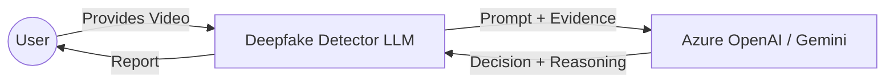

# ARCHITECTURE

## 1. Purpose

This document describes the high-level architecture of the project. It is intentionally written to provide a stable “big picture” early in development. Details may change, but the modular structure and component interfaces should remain consistent.

The system receives a video and outputs a classification: REAL or DEEPFAKE, using an LLM guided by prompt engineering.

---

## 2. High-Level System Flow

### 2.1 C4 Context Diagram
The system interacts with a User (who provides a video) and an External LLM Provider (Azure OpenAI) to perform reasoning.

### 2.2 C4 Container Diagram (Key Modules)
- **CLI**: Entry point for user commands.
- **Pipeline Orchestrator**: Manages data flow between blocks.
- **Forensic Engine**: Extracts evidence from video frames.
- **LLM Client**: Handles communication with the AI model.

---

## 3. Architecture Decision Records (ADRs)

### ADR 1: LLM-Assisted Reasoning vs. Direct Vision
- **Status**: Accepted
- **Context**: Traditionally, deepfake detection is a vision task. However, vision models are often "black boxes".
- **Decision**: Use LLMs to reason over *extracted* forensic evidence (textual/structured data).
- **Consequences**: Improved interpretability; easier to update detection logic via prompts; requires robust feature extraction.

### ADR 2: Building Block Design Pattern
- **Status**: Accepted
- **Context**: The system needs to be extensible for new forensic signals.
- **Decision**: Implement each module as an "independent building block" with defined Input/Output/Setup contracts.
- **Consequences**: High testability; modules can be replaced (e.g., swapping OpenCV for a different video backend) without side effects.

### ADR 3: State-on-Disk for Artifacts
- **Status**: Accepted
- **Context**: Debugging LLM reasoning requires seeing exactly what the model saw.
- **Decision**: Persist frames, evidence, and prompts to the `runs/` directory for every execution.
- **Consequences**: Disk usage increases, but transparency and reproducibility are maximized.

---

## 4. Directory Layout (Conceptual)

- src/deepfake_detector/
  - cli.py                 Command-line entry point
  - pipeline.py            Orchestrates the full flow
  - config.py              Loads configuration (.env, defaults)
  - types.py               Shared types (inputs/outputs between blocks)

  - video/
    - reader.py            Reads video metadata and streams frames
    - frames.py            Sampling, resizing, optional face-crop hooks
    - quality_checks.py    Validation and sanity checks on frames/video

  - prompts/
    - prompt_builder.py    Builds final prompts from templates + observations
    - templates/           Prompt templates (system/user/schema)
    - prompt_log.md        Prompt iteration log (required deliverable)

  - llm/
    - client_base.py       Abstract interface for LLM clients
    - gemini_client.py     Implementation for Gemini (or other chosen provider)
    - mock_client.py       Offline stub for tests/dev without API

  - decision/
    - aggregator.py        Combines one/many LLM outputs into final decision

  - generation/
    - opencv_generator.py  Synthetic video generator (primary)
    - flow_generator.md    Notes for optional Google FLOW generation

- docs/
  - PRD.md                 Product requirements
  - ARCHITECTURE.md        This document
  - EVALUATION.md          Evaluation plan + results
  - USER_GUIDE.md          How to run and use the tool (later)

- tests/
  - Unit tests for key building blocks

- assets/
  - sample videos, figures, placeholders

---

## 5. Building Blocks and Interfaces

This project is designed as a set of “building blocks” (Chapter 17 of Guidelines). Each block is a self-contained unit with:
- **Input Data**: Required runtime information (e.g., video path, frames).
- **Output Data**: The result produced by the block (e.g., extracted evidence).
- **Setup Data**: Configuration/parameters (e.g., threshold, model name).

The goal is that blocks can be tested independently and replaced without changing the whole system.

### 5.1 Block: VideoReader
- **Responsibility**: Load a video file and extract frames/metadata.
- **Input Data**: `video_path` (str)
- **Output Data**: `VideoMeta` object and frame iterable.
- **Setup Data**: Backend choice (OpenCV), `max_duration_seconds`.
- **Validation**: Checks if file exists, is a valid video, and has > 0 frames.
- **Module**: `src/deepfake_detector/video/reader.py`

### 5.2 Block: BlinkDetector
- **Responsibility**: Analyze eye ROIs across frames to detect blink events.
- **Input Data**: `eyes_rois_gray` (List[np.ndarray])
- **Output Data**: `BlinkEvidence` (count, confidence, series).
- **Setup Data**: `openness_threshold`, smoothing parameters.
- **Validation**: Ensures ROIs are not empty and have consistent dimensions.
- **Module**: `src/deepfake_detector/evidence/blink.py`

### 5.3 Block: LLMClient
- **Responsibility**: Send prompts to an LLM and receive structured reasoning.
- **Input Data**: `prompt_text` (str), `images` (Optional).
- **Output Data**: `LLMResponse` (raw text, parsed decision).
- **Setup Data**: `api_key`, `endpoint`, `model_name`, `temperature`.
- **Validation**: API key presence, response format validation.
- **Module**: `src/deepfake_detector/llm/client_base.py`

### 4.2 Block: FrameExtractor / Preprocessor
Responsibility:
- Sample frames from video (e.g., every N frames)
- Normalize size
- Optionally crop region of interest (face) via a hook
- Produce a clean batch of frames + timestamps

Input:
- frame_iterable
- video_meta

Output:
- FrameBatch: frames + timestamps + sampling info

Setup:
- sample_every_n_frames
- max_frames
- resize_to (W,H)
- optional face_crop_enabled (future extension)

Validation:
- Frame count within limits
- Frames are consistent in size after preprocessing

Failure modes:
- No frames sampled (bad sampling config)
- Unexpected frame shapes

Module:
- src/deepfake_detector/video/frames.py

---

### 4.3 Block: QualityChecks
Responsibility:
- Detect obvious issues early (fast-fail):
  - too few frames
  - resolution too low
  - frames mostly blank/dark
  - frame-to-frame duplication (optional)
- Provide warnings vs hard errors

Input:
- FrameBatch
- video_meta

Output:
- quality_report: structured warnings/errors

Setup:
- thresholds (min_frames, min_resolution, brightness threshold)

Validation:
- Deterministic checks

Failure modes:
- Raises error if essential requirements not met

Module:
- src/deepfake_detector/video/quality_checks.py

---

### 4.4 Block: Frame Summarizer (Observation Builder)
Responsibility:
- Convert frame batch into a compact, structured representation suitable for LLM reasoning
- Focus on temporal consistency signals (eyes/mouth/lighting/texture)
- Avoid being overfit to one specific synthetic video

Important note:
- The LLM will not be given raw pixels directly in this baseline design.
- Instead, we generate textual/structured observations and prompt the LLM on them.

Input:
- FrameBatch
- video_meta

Output:
- PromptInput:
  - timeline observations
  - key-frame notes
  - motion consistency notes
  - known limitations

Setup:
- observation granularity (per frame vs per segment)
- heuristics toggles (blink detection placeholder, etc.)

Validation:
- Ensure output is bounded in size
- Ensure stable schema

Failure modes:
- If summarization produces empty content, return an error or fallback summary

Module:
- src/deepfake_detector/pipeline.py (initially)
- Later can move to src/deepfake_detector/video/ or a new src/deepfake_detector/analysis/

---

### 4.5 Block: PromptBuilder
Responsibility:
- Build LLM prompts using versioned templates
- Inject structured observations into templates
- Enforce output format constraints (e.g., JSON schema)

Input:
- PromptInput
- prompt templates (system/user/schema)

Output:
- PromptPayload:
  - system_message
  - user_message
  - expected_output_schema (or strict instruction)

Setup:
- template paths
- prompt version id

Validation:
- Ensure required placeholders are filled
- Ensure output length constraints are respected

Failure modes:
- Missing template file
- Missing required placeholders

Module:
- src/deepfake_detector/prompts/prompt_builder.py
- src/deepfake_detector/prompts/templates/*

---

### 4.6 Block: LLMClient
Responsibility:
- Call the selected LLM provider API
- Return structured LLM output (prefer JSON)
- Handle retries, timeouts, and basic error normalization

Input:
- PromptPayload

Output:
- LLMResult:
  - label: REAL/DEEPFAKE
  - confidence: optional (0-1)
  - evidence: list of short bullet reasons
  - raw_text: original response (for debugging)

Setup:
- API key via environment variable
- model name
- temperature
- max tokens

Validation:
- Validate returned schema keys
- If malformed, attempt one repair pass (optional) or mark as invalid

Failure modes:
- Network/API errors
- Rate limiting
- Non-JSON output despite instructions

Modules:
- src/deepfake_detector/llm/client_base.py
- src/deepfake_detector/llm/gemini_client.py
- src/deepfake_detector/llm/mock_client.py

---

### 4.7 Block: DecisionAggregator
Responsibility:
- Combine one or many LLM results into a final decision
- Provide deterministic aggregation logic:
  - single call: use that label
  - multi-call: majority vote, tie-breaking rule
- Optionally compute an internal confidence score

Input:
- list[LLMResult]

Output:
- DecisionResult:
  - final_label
  - final_confidence (optional)
  - evidence_summary (merged evidence)

Setup:
- aggregation mode (single, majority_vote)
- tie_breaker (e.g., DEEPFAKE on tie or REAL on tie; must be documented)

Validation:
- Ensure non-empty results list
- Ensure labels are valid

Failure modes:
- All results invalid -> return “UNKNOWN” (optional) or raise error

Module:
- src/deepfake_detector/decision/aggregator.py

---

### 4.8 Block: Report Writer (Output)
Responsibility:
- Save results to disk
- Provide a minimal JSON format suitable for evaluation scripts
- Optionally store debug artifacts:
  - prompt used
  - LLM raw output
  - quality report

Input:
- DecisionResult
- optional debug bundle

Output:
- results.json (and optional debug files)

Setup:
- output directory
- debug mode on/off

Validation:
- Ensure output directory exists

Module:
- src/deepfake_detector/utils/io.py

---

## 5. CLI Design (Contract)

Primary command:
- deepfake-detector analyze --video <path> --out <results.json>

Optional commands:
- deepfake-detector generate --mode opencv --out <video.mp4>
- deepfake-detector prompts --version <id> (prints template info)

CLI should:
- Validate inputs early
- Print clear errors
- Exit with non-zero code on failure

Module:
- src/deepfake_detector/cli.py

---

## 6. Configuration Management

- All secrets (LLM API keys) must be loaded from environment variables.
- Provide .env.example with required variable names.
- Never commit .env.

Example variables (names may change):
- LLM_PROVIDER=gemini
- GEMINI_API_KEY=...
- MODEL_NAME=...
- SAMPLE_EVERY_N_FRAMES=...
- MAX_FRAMES=...

Module:
- src/deepfake_detector/config.py

---

## 7. Prompt Engineering Log

Prompts are a core deliverable. The repo includes:
- prompts/templates/ for versioned templates
- prompts/prompt_log.md to document changes

The prompt log should include:
- prompt version id
- what changed
- why it changed
- example input snippet
- example output snippet

Location:
- src/deepfake_detector/prompts/prompt_log.md

---

## 8. Testing Strategy (Planned)

Unit tests will focus on building blocks:
- PromptBuilder fills templates and enforces schema
- DecisionAggregator is deterministic
- Frame extraction produces expected counts
- Quality checks catch obvious failures
- Mock LLM client enables offline tests

Location:
- tests/

---

## 9. Performance Considerations (Planned)

This is a batch pipeline. Primary concerns:
- Do not send too many frames to the LLM
- Keep the prompt size bounded (summaries, not raw frames)
- Provide sampling controls (max_frames, sample_every_n_frames)

---

## 10. Known Limitations (Current)

- LLM may be inconsistent; aggregation mitigates some variance.
- Without pixel-level ML models, subtle deepfakes may not be detected.
- Prompt design must avoid overfitting to the synthetic generator.

These limitations will be documented and discussed in EVALUATION.md.

---
